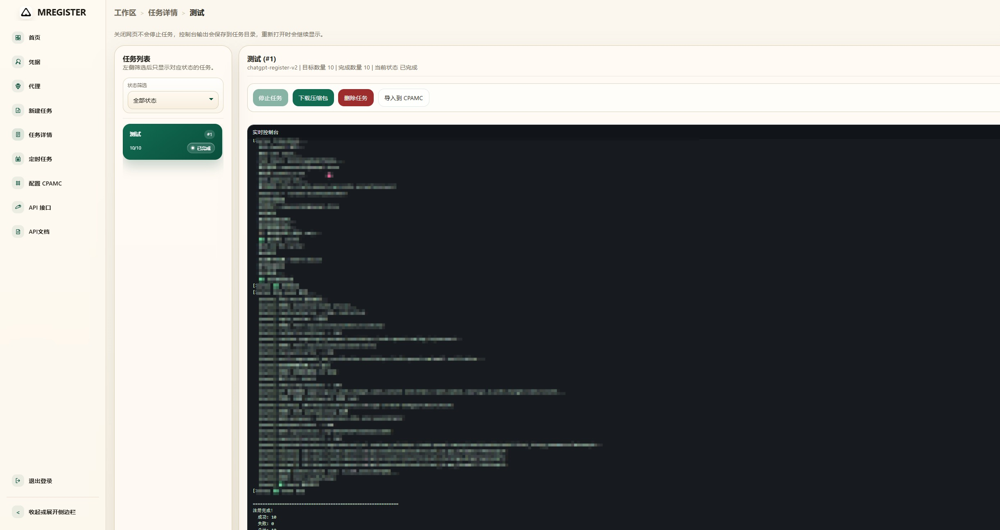

# MREGISTER Web UI 控制台  暂时无法使用恢复的通知

!!!强烈建议使用自定义域名 GPTMAIL 成功率高 买域名上spaceship.com 便宜点不是广告
`MREGISTER` 是一个基于 FastAPI 的控制台，用来统一管理 `openai-register已经废弃删除`、`chatgpt_register_v2` 和 `grok-register` 三个注册脚本。它把原本偏命令行的执行方式包装成可持久化、可排队、可下载结果、可通过 API 调用的任务系统。

新增功能：

- 一键导入：一键导入到CPAMC 可以设置 任务完成自动导入到CPAMC 




本文档只保留中文，并重点说明：

- 如何部署
- 数据如何持久化
- 如何创建并调用 API
- 任务结果如何查询和下载

## 目录

- [项目结构](#项目结构)
- [核心能力](#核心能力)
- [部署前准备](#部署前准备)
- [本地部署](#本地部署)
- [Docker Compose 部署](#docker-compose-部署)
- [持久化与目录说明](#持久化与目录说明)
- [首次登录与基础配置](#首次登录与基础配置)
- [API 调用流程](#api-调用流程)
- [外部 API 说明](#外部-api-说明)
- [常见部署建议](#常见部署建议)

## 项目结构

- `web_console/`
  - FastAPI 控制台
  - 前端静态资源与模板
  - SQLite 运行时数据库
  - Dockerfile
- `chatgpt_register_v2/`
  - ChatGPT 注册脚本（支持 GPTMail 适配）
- `grok-register/`
  - Grok 注册脚本
- `docker-compose.yml`
  - 容器化部署配置

## 核心能力

- 管理员密码登录
- 创建任务、排队执行、停止任务
- 查看实时日志与历史日志
- 下载任务结果压缩包
- 管理 GPTMail、YesCaptcha、代理
- 定时任务
- 通过 API Key 调用外部任务接口
- SQLite 持久化保存配置与任务记录

## 部署前准备

建议先确认以下条件：

- 已安装 Python 3.12 或 Docker / Docker Compose
- 服务器可以访问外部网络
- 已准备好 GPTMail API Key
- 如需 `grok-register`，准备好 YesCaptcha Key
- 如需代理，提前确认代理出口可用

推荐优先使用 Docker Compose 部署，默认直接拉取 `maishanhub/mregister:main` 镜像，便于快速上线和保留运行数据；如果只是本地调试，也可以直接用 Python 启动。

## 本地部署

### 1. 安装依赖

```bash
python -m pip install -r web_console/requirements.txt
```

### 2. 启动控制台

```bash
uvicorn web_console.app:app --host 0.0.0.0 --port 8000
```

### 3. 打开页面

```text
http://服务器IP:8000
```

首次打开会进入协议确认与初始化页面，需要先完成协议同意流程，再设置管理员密码。

## Docker Compose 部署

当前仓库已经带好了 `docker-compose.yml`，默认直接拉取 仓库：

```text
https://github.com/Maishan-Inc/MREGISTER.git
```

### 1. 拉取镜像

```bash
docker compose pull
```

### 2. 启动服务

```bash
docker compose up -d
```

### 3. 查看状态

```bash
docker compose ps
```

### 4. 查看日志

```bash
docker compose logs -f
```

### 5. 访问控制台

```text
http://服务器IP:8000
```

### 6. 停止服务

```bash
docker compose down
```

说明：

- `docker-compose.yml` 现在默认从 Docker Hub 拉取 `maishanhub/mregister:main`
- 不再依赖本地执行 Docker build
- 容器默认监听 `8000` 端口

## 持久化与目录说明

控制台的关键数据保存在：

- 数据库：`web_console/runtime/app.db`
- 任务目录：`web_console/runtime/tasks/`

`docker-compose.yml` 已经把运行目录挂载到宿主机：

- 宿主机：`./web_console/runtime`
- 容器内：`/app/web_console/runtime`

这意味着只要 `web_console/runtime/` 没被删除，下面这些内容都会保留：

- 管理员密码哈希
- 凭据配置
- 代理配置
- API Key
- 任务记录
- `console.log`
- 输出文件
- 压缩包下载文件

## 首次登录与基础配置

部署完成后，建议按下面顺序配置：

1. 首次打开页面，阅读 Maishan Inc. 非商业协议并滚动到底部
2. 点击“下一步”后，手动输入“我同意此条款”
3. 设置管理员密码并进入后台
4. 进入“凭据”页面，新增 GPTMail 凭据
5. 如需 `grok-register`，再新增 YesCaptcha 凭据
6. 如需固定出口，进入“代理”页面新增代理并可设置默认代理
7. 进入“API”页面创建一个 API Key
8. 再去“API文档”页面复制调用示例

如果你只打算通过 API 调用任务，最少要完成下面两步：

- 设置管理员密码
- 创建默认 GPTMail 凭据，并生成 API Key

## API 调用流程

推荐的调用流程如下：

1. 在控制台里创建 API Key
2. 调用 `POST /api/external/tasks` 创建任务
3. 轮询 `GET /api/external/tasks/{task_id}` 查询任务进度
4. 等任务完成后，再调用 `GET /api/external/tasks/{task_id}/download` 下载结果

对于 API 创建的任务：

- `completed_count` 表示真实成功数，不是尝试次数
- `download_url` 只有在任务完成并生成压缩包后才会出现
- API 创建的任务会在完成 24 小时后自动清理

## 外部 API 说明

### 鉴权方式

请求头必须带：

```text
Authorization: Bearer YOUR_API_KEY
```

### 1. 创建任务

请求：

```http
POST /api/external/tasks
Content-Type: application/json
Authorization: Bearer YOUR_API_KEY
```

请求体示例：

```json
{
  "platform": "openai-register",
  "quantity": 10,
  "use_proxy": true,
  "concurrency": 1,
  "name": "openai-batch-01"
}
```

字段说明：

- `platform`：任务平台，当前支持 `openai-register`、`chatgpt-register-v2`、`grok-register`
- `quantity`：目标成功数量
- `use_proxy`：是否使用默认代理，`true` 表示使用，`false` 表示不使用
- `concurrency`：并发数，默认 `1`
- `name`：任务名称，可不传

`curl` 示例：

```bash
curl -X POST "http://127.0.0.1:8000/api/external/tasks" \
  -H "Authorization: Bearer YOUR_API_KEY" \
  -H "Content-Type: application/json" \
  -d "{\"platform\":\"openai-register\",\"quantity\":10,\"use_proxy\":true,\"concurrency\":1,\"name\":\"openai-batch-01\"}"
```

返回示例：

```json
{
  "task_id": 12,
  "status": "queued",
  "target_quantity": 10,
  "completed_count": 0,
  "auto_delete_at": "2026-03-21 12:00:00",
  "download_url": null
}
```

### 2. 查询任务状态

请求：

```http
GET /api/external/tasks/{task_id}
Authorization: Bearer YOUR_API_KEY
```

`curl` 示例：

```bash
curl "http://127.0.0.1:8000/api/external/tasks/12" \
  -H "Authorization: Bearer YOUR_API_KEY"
```

返回示例：

```json
{
  "task_id": 12,
  "status": "running",
  "completed_count": 4,
  "target_quantity": 10,
  "auto_delete_at": "2026-03-21 12:00:00",
  "download_url": null
}
```

状态通常包括：

- `queued`
- `running`
- `stopping`
- `completed`
- `partial`
- `failed`
- `stopped`
- `interrupted`

### 3. 下载结果压缩包

请求：

```http
GET /api/external/tasks/{task_id}/download
Authorization: Bearer YOUR_API_KEY
```

`curl` 示例：

```bash
curl -L "http://127.0.0.1:8000/api/external/tasks/12/download" \
  -H "Authorization: Bearer YOUR_API_KEY" \
  -o result.zip
```

只有在任务完成且压缩包已生成时，这个接口才可以正常下载。

## 常见部署建议

如果你准备正式长期使用，建议至少做下面这些事：

- 在外层加 Nginx / Caddy 反向代理
- 配置 HTTPS
- 只开放必要端口
- 定期备份 `web_console/runtime/`
- 不要把控制台直接裸露到公网上
- 如果是远程服务器，给 Docker 设置自动重启

如果你后面要把这个服务对接到自己的程序，建议调用方式固定为：

1. 你的程序只保管 API Key
2. 只调用外部 API，不直接操作数据库
3. 用轮询查询进度
4. 完成后立即下载压缩包并转存

这样后续迁移、扩容和替换部署方式都会更容易。
